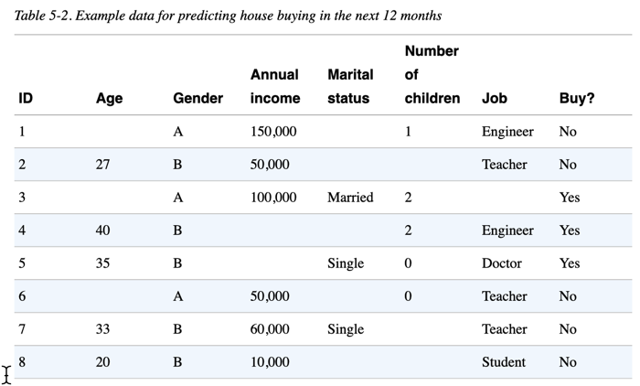
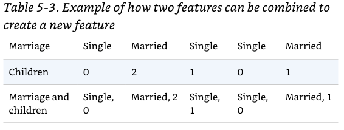
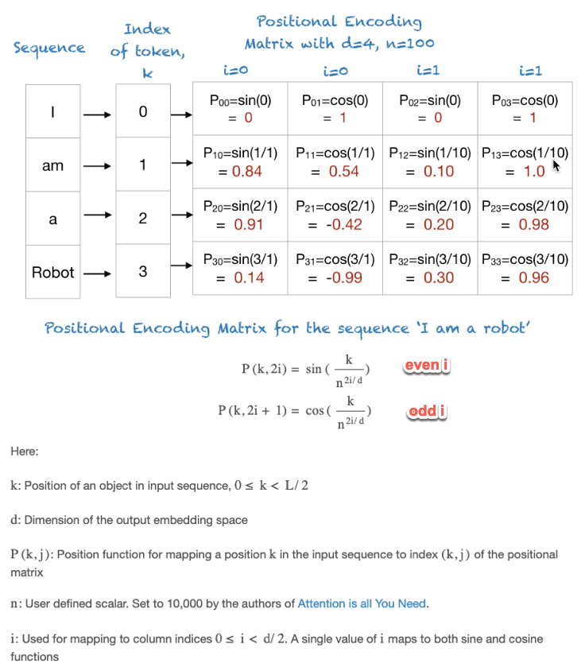
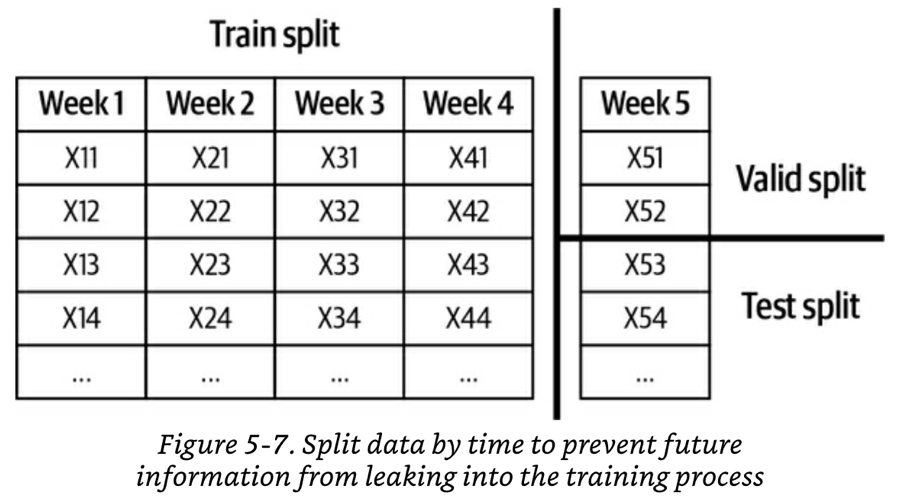

# 5 - Feature Engineering
Once you have a workable ML model, feature engineering tends to give you the biggest performance boost compared to hyper-parameter tuning or using clever algorithmic techniques.

This chapter covers:
- Common operations that you will use while doing feature engineering (e.g. scaling, discretization, handling missing values, etc).
- How to avoid the **data leakage** pitfall.
- Feature engineering best practices.

Feature engineering is NOT a one time thing. Feature engineering will continue as long as your model is in production. [Chapter 9](09-continual-learning-and-test-in-production.md) describes how to use new incoming data to keep improving your model.

Feature stores will be covered in [Chapter 10: Infrastructure and tooling for MLOps](10-infrastructure-and-tooling-for-ml-ops.md). 

# Learned Feature VS Engineered Features
Why do we have to worry about feature engineering? Doesn’t deep learning promise us that we no longer have to engineer features?

Yes, deep learning is capable of automatically extracting features from raw data. However, as of 2022, we are still **far** from the point where **all** features can be automatically learned. Furthermore, as of 2022, **the vast majority of ML in production is NOT deep learning.** Given this, careful handcrafted feature engineering is still critically important to ML in production.

## Which features can be learned and which still need to be handcrafted?
Vectorization of raw text and raw images are two very common examples of features that can be learned. However, in production applications **vectorized raw data is rarely the only features you need**.  These vectors are usually augmented with a significant number of features that cannot be automatically extracted (e.g. number of likes, age of account, number of repiles, etc).  All of these other features still need to be handcrafted.

Applications that need a lot of domain expertise (like bank fraud) are also a common case where handcrafted features are still needed. In these cases, ML engineers usually work hand in hand with domain experts to determine the features.

# Common feature engineering operations
In this section, we will discuss several of the most important operations that you might want to consider while engineering features from your data.  The list of techniques covered is far from exhaustive. However, it is a good starting point.

## Handling missing values

Having missing values in features is extremely common. However, **not all missing values are equal** and the type of missing value you have impacts how you can handle it.

We will illustrate the [Types of missing values](#Types%20of%20missing%20values) and the [Techniques for handling missing values](#Techniques%20for%20handling%20missing%20values) with the following example.

### Types of missing values

#### Missing not at random (MNAR)
When the reason the value is missing is related to the *value itself*. For example, high income earners do not like to disclose their income. Another common example is people with certain illnesses do not like to disclose that information.

#### Missing at random (MAR)
This is when the reason a value is missing is not due to the value itself, but due to **another observed variable.**

In the example above, we can tell that people with *gender A* do not like to disclose their age.

#### Missing completely at random (MCAR)
When missing values do not follow any pattern. For example, people just forget to fill in that value sometimes for no particular reason. However, this type of missing is very rare. There are usually reasons why certain values are missing, and you should investigate. 

### Techniques for handling missing values
The two most common techniques for handling missing values are **deletion** and **imputation**.

Keep in mind that there **is no perfect way** of handling missing values. All techniques have tradeoffs and introduce risks.

#### Deletion
##### Column deletion
- If a variable has too many missing values, remove that variable (i.e. delete the column).
- **Pros:** easy to do.
- **Cons:** you may remove an important feature and reduce the accuracy of your model. 

##### Row deletion
- If a sample has missing values, just remove the sample (i.e. the row).
- This technique works when the missing values are [Missing completely at random MCAR](#Missing%20completely%20at%20random%20MCAR) AND the number of samples to remove is small (e.g. less than 0.1%)
- **Pros:** it is easy to do.
- **Cons:** 
	- Row deletion of missing values that are [Missing not at random MNAR](#Missing%20not%20at%20random%20MNAR) will remove important information for your model. In the example above, removing samples with no annual income will mean that you are removing samples from people that preferred not to disclose their income because they probably are high income earners.
	- Row deletion of missing values that are [Missing at random MAR](#Missing%20at%20random%20MAR) can introduce biases into your model. In the example above, if you remove all samples that are missing the age, you will also remove all samples with gender A. This means that your model will not be able to produce good predictions for people with gender A.

#### Imputation
- Fill missing data with *certain value.* Deciding which value to use is the hard part.
- **Cons:** you can inject your own bias to data, introduce noise or create [Data Leakage](#Data%20Leakage).

##### Imputation with default values
- Fill missing data with a sensible default like empty string for missing strings.
- Avoid filling missing values  with values that are actually possible. For example, do not fill a missing *"number of children"* value with 0. Zero is a possible (and common) value for *"number of children"*.

##### Imputation with mean, median or mode
- Fill missing data with the column mean, median or mode.
- You can also do smarter things like calculating the mean taking into account other related variables. For example, fill in a missing temperature with the average temperature for the record's month.

##### Imputation through ML
- You can create simple classifiers or regressors using other rows as features to predict the most likely value for the missing data.  

## Scaling
In general, we want all features to have a similar order of magnitude. We do this to prevent features that naturally have larger numbers (like salaries) from numerically overpowering features that have smaller numbers (like ages).

Scaling can often result in performance boosts and NOT doing it can result in gibberish predictions.

Common scaling techniques are:
- **Scale to an arbitrary range** like [0, 1] or [-1, 1]. Chip has found empirically that the latter one works better.
- **Scale to a normal distribution** with 0 mean and variance of 1. Do this if your variables are normally distributed.
- **Log transformations** are useful when the distribution of a variable is heavily skewed. ML models in general struggle with skewed distributions.

Important things to note about scaling:
1. Scaling is a common source of [Data Leakage](#Data%20Leakage)
2. Scaling requires global statistics of the dataset to, for example, find the `min` and `max`. Global statistics are not always easy to compute on large datasets.
3. Scalers need to be built using the training data and are applied "as is" on the prediction data.  If the distribution of the features at prediction time is different than in training, the scalers can output gibberish data. This is a signal that the scalers and models will need to be retrained.

## Discretization of continuous features
Discretization is the process of turning a continuous feature into a discrete feature by creating "buckets" like `Low income: less than 35k/year`.

**In theory**, the motivation of doing this is that it is easier for algorithms to deal with a small number of categories (e.g. low income, medium income, high income) than to teal with "infinite" continuous possible incomes. This benefit is supposed to be bigger when you have limited training data

**Cons:**
- The author says that she hasn't seen discretization help much in practice. 
- Discretization introduces discontinuities at the category boundaries, causing small changes in a continuous variable close to the boundary to be treated wildly differently.
- Choosing the buckets is not trivial. You can derive them from histograms, use basic quantiles or subject matter expertise. 

## Encoding Categorical Features

Encoding categorical features has an easy case and a hard case. 
- Things are easy when the number of categories you have during training is guaranteed to be the same  in production.  
- Things get significantly more challenging when a feature can have more / different categories in production than in training. This is very common when using things like `Brand Names`, `Usernames`, `Product Types` as features. In general, this happens when it is possible for a new entry to the category to be dynamically created in production.

### Easy case: Static categories
Dealing with encoding is easy when the number of categories don't change over time. The usual way to proceed is to assign each category value a unique number and possibly do one-hot encoding.

### Hard case: dynamic categories
There are 2 common ways of **mishandling** the encoding of dynamic categories.
- **Treat the same way as static:** Build a static encoder, use it in prod and hope for the best. This will likely make your model crash in production as soon as it encounters a category value (e.g. a new brand) that it hasn't seen before.
-  **Add a catchall UNKNOWN category to the encoding:** This will stop your model from crashing. 
	- You **must** make sure you train your model with UNKNOWN samples as well. Otherwise the model will not crash but the predictions for observations with UNKNOWN feature values will be useless as it didn't see any of those during training.
	- Even if you do the above, the model performance for observations with UNKNOWN brand will be poor and degrade quickly. For example, your store might have 30 new brands sign up in prod after you train. Some are well established and some are knockoff brands. All of these will be treated equally inside the UNKNOWN bucket and prediction quality will be poor.

#### Solution: The hashing trick
Intuition: map categories to a value using a hashing function with a known hashing space (e.g. 18 bits = 262,144 possible values to map to). 

The *hashing trick* is not typically taught in universities because it is a trick. However it has proven to be very valuable for ML in production and is included in tools like Vowpal Wabbit, SKLearn, TensorFlow and Gensim.

As with any hashing function, two different categories  may get encoded into the same value (i.e. a collision). Despite sounding problematic, research has shown that the impact of collisions in model performance is not that bad. Research by Booking.com showed that a 5

0% collision rate only caused an increase in log-loss of 0.5% (There is a graph in the book that shows the research output).

You can choose a hash space large enough to reduce the collision. You can also choose a hash function with properties that you want, such as a locality-sensitive hashing function where similar categories (such as websites with similar names) are hashed into values close to each other.

The hashing trick can be especially useful in [continual learning settings.](09-continual-learning-and-test-in-production.md) 

## Feature Crossing
- Combine two or more features to generate new features.
- Combining features can help reduce non-linearities that exist between features. This in turn greatly helps models that are bad at learning non-linear relationships such as linear regression, logistic regression and tree-based models.
- Eliminating non-linearities is less important for neural networks, although explicit feature crossing can help neural networks learn the non-linearities faster.

**Risks of feature crossing**
- Feature crossing can make your **feature space blow up**. e.g. crossing a feature that has 100 possible values with another that has 100 possible values will result in a crossed feature space of 10,000.
- After crossing, you will have much less samples for each of the possible crossed values. You will need al lot more data to learn useful things for all this possible values.
- Feature crossing can help models overfit the training data.

## Discrete and continuous positional embeddings

Positional Embeddings are now standard for computer vision and NLP tasks. We will discuss this topic using NLP examples.

 The way neural networks and convolutional neural networks process their input means that the order of the sequence (e.g. words) is implicitly known by the neural network. However, in models like transformers, **all the words are processed in parallel, so words' positions needs to be explicitly inputted.**

The position of an element in a sequence can be discrete (e.g. first token, second token) or continuous (e.g. element at position 1.35).  

 ### Naive discrete positional embedding: Use indexes
The naive approach would be to use  indexes (e.g. 0, 1... k) to describe the position of the token and then [scale](#Scaling) them to a range like [-1, 1] to make it usable by neural networks.

This approach has some problems:
- For long sequences, the numerical difference between positions becomes too small. This makes it difficult for a NN to tell the difference between one position and the other.
-  Scaling is a function is the sequence length. This means that the encoding for a given position (e.g. position 2) will be different for a sequence of length 5 and a sequence of length 100.

### Fixed discrete embeddings
In fixed discrete embeddings, position of each element is represented by a vector. This vector is typically the **same length as the word embedding vector** (e.g. 512 elements) and can be fully precomputed for any sequence length. 

To use this in a NN, the word embedding is added to the corresponding positional embedding. The output of this operation is used as input for the rest of the network.

The computation of the fixed positional embedding uses `sine` and `cosine` functions so each element in the vector is between [-1, 1]. The image below shows a quick overview of how this is calculated. A full explanation can be found [in this amazing post](https://machinelearningmastery.com/a-gentle-introduction-to-positional-encoding-in-transformer-models-part-1/).

### Learned discrete embeddings
They are used in the same way as [fixed discrete embeddings](#Fixed%20discrete%20embeddings) (i.e. adding the word embedding and the position embedding together). However, instead of pre-computing the positional embedding, the embedding is learned during training through back propagation.

This is the way position embeddings are implemented in Hugging Face's BERT.

### Continuous embeddings
When positions are continuous, learning the embeddings is very hard. However, fixed (pre-computed) sine and cosine based embeddings still work.  This is also known as **Fourier Features** and [Fixed discrete embeddings](#Fixed%20discrete%20embeddings) are just a special case of the general continuous case. 

# Data Leakage
Data leakage is when a model gains an unfair performance advantage during training, validation and testing by learning to exploit information that "leaks" the real label of the data. This advantage is usually an artefact of how the data was collected, processed or split. 

The advantage is **not available at inference time** making your model fail in production in non-obvious and espectacular ways. The leak is usually not perceptible during validation and testing because those datasets might be part of the problem.

## Common causes for data leakage

### Splitting time-correlated data randomly instead of by time
An oversimplified example: Imagine you want to predict the Google stock price based on the behaviour of all other stocks in the previous 6 days. If you split your data randomly (instead of by time), you will include stock prices of other companies on the 7th day, giving your model the unfair advantage of knowing something about the future.

Generally speaking, if a label's value is correlated with time, you probably want to split your data into train, validation and test datasets by time and **not randomly.**

### Scaling before splitting
If you scale your features before splitting into train, validation and test, the scalers will encode information like the max, min, average, etc from the data that will end up in the validation and tests sets and that was meant to be fully unseen to the model.

To avoid this, split the data first and build your scalers **only on your training data.** Then use the training scalers to scale the other two splits. Some people even argue that you shouldn't do exploratory data analysis on the validation and test sets to avoid leaking assumptions into the training.

### Filling missing data with statistics from the validation or test split
This is similar to the above. You don't want your imputation process to know anything about the validation and test sets.

### Poor handling of data duplication before splitting

Failing to remove duplicates or near-duplicates from your data before splitting your data into training, validation and test sets will allow your model to observe the same samples at training and validation/test time. 
- Duplication is very common in industry and research datasets. Some popular datasets like CIFAR-100 had 10% of duplicates.
- Data duplication can happen at collection time, when merging different data sources, or at processing time (e.g. when oversampling).
- **Always check your data for duplicates before splitting** and after splitting (just to be sure).
- If you are [oversampling](04-training-data.md#data-level-methods-resampling), do it **after** splitting.

### Group leakage
This is better explained through an example: a patient might have two lung CT scans a week apart. Both CT scans make it to your data and they probably contain the same label (they are effectively the same sample). If you split randomly, you might get one CT scan in the training data and the other one in the validation/test set. 

The only way to avoid this is by understanding how your data was generated.

### Leakage from the data generation process
Imagine you are building a model to help label lung cancer. A highly specialised oncologic hospital shares their data with you as do other less specialised hospital. The CT scan machine from the specialised hospital produces its CT scan in a special format.  If the data is not processed correctly, your model might exploit the format of the CT scan to assign labels as it CT scans from the specialised hospital are more likely to contain a positive label. Of course the format shouldn't have to do anything with the diagnosis.

To avoid this, think of ways to normalise your data to reduce the likelihood of your model exploiting pseudo-features about how the data was collected that should not influence the training.

### Misusing the test split
If you use the test split in any way other than to report a model’s final performance, whether to come up with ideas for new features or to tune hyper-parameters, you risk leaking information from the future into your training process.

## Detecting data leakage
Measure the predictive power of each feature or a set of features with respect to the target variable (label). If a feature or a set of features has an unusually high correlation with the label, investigate how this feature is generated and whether or not the correlation makes sense. 
- A way to do measure this predictive power is by doing ablation studies on your features (or set of features): remove a feature and see if the model's performance deteriorates significantly. 
- Keep an eye out for when new features are added to your model. If adding a feature causes a significant jump in performance, investigate if it makes sense.