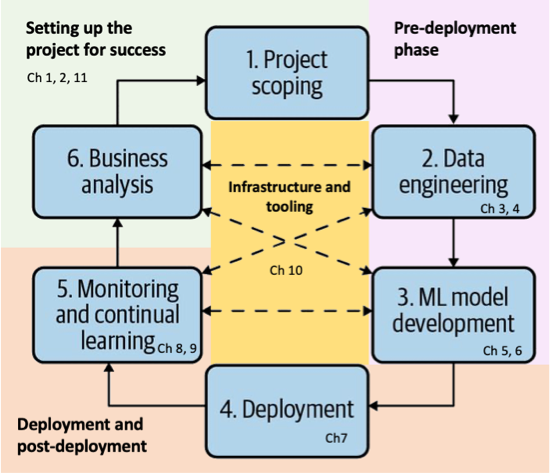

# Designing Machine Learning Systems
This is a summary of [Designing Machine Learning Systems](https://www.oreilly.com/library/view/designing-machine-learning/9781098107956/) by Chip Huyen. All credit to her and O'Reilly. 

I took these note for my own learning and future reference. I'm ok with PRs to improve sections.

**Context before you read this book**

- As of 2022, the vast majority of ML applications in production are **supervised ML** models. This book focuses almost exclusively on putting supervised ML models in production.

- This book won't teach you how to do ML modelling. Furthermore it assumes that you have at least a high level understanding of ML modelling. 

# Navigating this Book
This book can be navigated in two ways: 

1. From the perspective of the components of an ML system.
2. From the perspective of the never-ending iterative process required to design, operate and continually improve an ML system in production.

*1. Book navigation from the perspective of the components of an ML system*

*2. Book navigation from the perspective of the iterative process to build ML systems*

## Table of Content

**[Chapter 1: Overview of ML Systems](01-overview-of-ml-systems.md)**
- When to use ML (and when not to)
  - Problem characteristics needed for ML solutions to work
  - Problem characteristics that will make ML solutions especially useful
  - Typical ML use cases
- ML in research vs production
- ML systems vs traditional software

**[Chapter 2: Project objectives, requirements and framing](02-project-objectives-requirements-and-framing.md)**
- The relationship between business and ML objectives 
- Requirements for ML Systems: Reliability, Scalability, Maintainability, Adaptability
- Framing of ML Problems in way that makes your job easier.
  - Types of supervised ML Tasks
  - Objective Function Framing in Multi-objective Applications

**[Chapter 3: Data Engineering Fundamentals](03-data-engineering-fundamentals.md)**
- Quality of the algorithm VS quality and quantity of the data
- Data sources for your ML project
- Choosing the right Data format
- Tradeoffs of the data models to store your data: Structured vs Unstructured
- Data warehouses vs data lakes
- Database engines for transactional processing vs analytical processing (OLTP vs OLAP)
- Data processing ETLs
- Modes of dataflow:  passing data through DBs vs passing through services vs passing through events
- Batch processing vs stream processing
